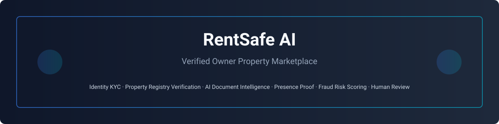
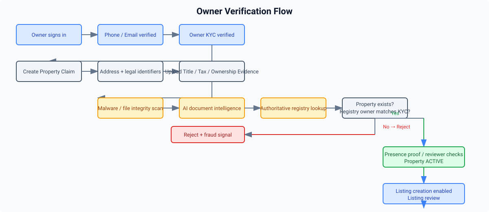
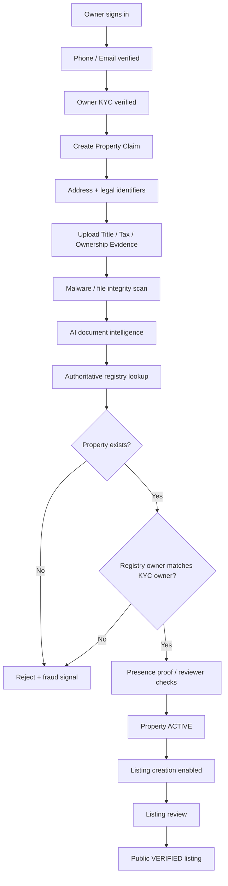

<div align="center">



# RentSafe AI — Verified Owner Rental Marketplace

### Property listings should come from the legal owner, not a broker pretending to be one.

**Identity KYC · Property Registry Verification · AI Document Intelligence · Presence Proof · Fraud Risk Scoring · Human Review**

</div>

---

## Why RentSafe AI exists

Rental fraud often starts before a tenant ever visits a property: a broker, impersonator, or scammer copies a legitimate property's photos, claims to be the owner, asks for an advance, and disappears.

RentSafe AI changes the trust model.

A property can be **claimed** by a verified user, but it cannot become an active property or be used for a public listing until the platform verifies that:

1. the person has passed owner identity/KYC checks;
2. the property itself exists in an authoritative property/registration source;
3. the authoritative source identifies the same person as the owner;
4. uploaded ownership evidence is internally consistent with the KYC identity and property;
5. property identifiers are not already claimed by another account;
6. presence/evidence checks and reviewer controls pass.

> **Core rule:** AI can detect inconsistencies and assist reviewers, but AI alone must never establish legal ownership. Authoritative registry evidence is a non-overridable gate.

---

## Trust flow





---

## Architecture


| Layer | Technology / responsibility |
|---|---|
| Web | Next.js App Router owner + reviewer experience |
| Mobile | React Native / Expo tenant experience |
| API | NestJS authorization, verification orchestration, listing gates |
| Data | PostgreSQL + Prisma |
| Files | Private S3-compatible storage / MinIO, presigned uploads |
| Async | BullMQ + Redis |
| Identity | Owner KYC + verified phone/email |
| AI | OCR/document field extraction, cross-document consistency, tamper risk |
| Registry | State/authority-specific property registry adapter |
| Safety | Fraud signals, audit logs, reviewer queue, non-overridable ownership checks |

---

## The ownership verification model

### 1. Identity is necessary, but not sufficient

The current owner onboarding verifies the user's identity. That stops anonymous listing creation, but a real person can still falsely claim somebody else's property.

RentSafe therefore separates:

- **Who are you?** → KYC
- **Does this property exist?** → registry existence check
- **Do you legally own this property?** → authoritative owner match
- **Does your submitted evidence agree?** → AI + reviewer checks

### 2. Property registration is now a claim first

`POST /property/register` creates an **INACTIVE property claim**. It is not treated as a verified property.

The service immediately creates pending verification records:

- `REGISTRY_EXISTENCE`
- `OWNERSHIP_MATCH`
- `DOCUMENT_AI`

A claim becomes `ACTIVE` only after the hard ownership checks pass.

### 3. Hard checks cannot be manually overridden

These checks are non-overridable:

- `REGISTRY_EXISTENCE`
- `OWNERSHIP_MATCH`

A reviewer may resolve soft/AI checks with a documented reason, but cannot convert a failed registry ownership match into a verified property.

### 4. Listing creation and publishing are gated

The listing service verifies all hard ownership checks before allowing a listing to be created, submitted, or published.

That means a broker can create an account and even upload a forged PDF, but cannot obtain an active property/listing unless the authoritative ownership source returns a matching owner.

---

## AI approach

AI is used as a **fraud detection and review accelerator**, not as a legal authority.

### AI document intelligence checks

For uploaded `TITLE_EXTRACT`, `PROPERTY_TAX`, and other ownership evidence, a production document-intelligence provider should extract:

- owner name;
- property address;
- survey / subdivision / plot / door number;
- document or registration reference;
- issue/registration date;
- document structure;
- suspicious edits or tamper indicators.

The resulting fields are compared against:

- verified KYC owner name;
- normalized property address;
- supplied property identifiers;
- authoritative registry result;
- previously registered property identifiers.

### Suggested AI models / components

A production deployment can use:

- OCR: PaddleOCR, Tesseract, Surya, or a managed OCR service;
- document layout: LayoutLM / Donut-style models;
- name/address matching: embeddings + deterministic normalization;
- tamper checks: image forensics + metadata consistency;
- risk classifier: a small supervised model over platform fraud signals.

The repository overlay intentionally ships a **sandbox provider** with deterministic behavior so local development does not pretend to perform legal verification.

---

## Verification decision matrix

| Check | Source | Auto decision? | Reviewer override? |
|---|---|---:|---:|
| Owner identity | KYC provider | Yes | Restricted |
| Registry existence | Authoritative registry | Yes | **No** |
| Registry owner match | Authoritative registry | Yes | **No** |
| Document AI | OCR / AI | Assistive | Yes |
| Name match | AI + deterministic normalization | Assistive | Yes |
| Identifier match | Registry + local duplicate checks | Yes | Restricted |
| Presence proof | GPS + challenge media | No/assistive | Yes |
| Listing review | Human reviewer | No | Admin policy |

---

## New API flow

### Register an inactive property claim

```http
POST /api/v1/property/register
Authorization: Bearer <owner-token>
Content-Type: application/json
```

```json
{
  "propertyType": "APARTMENT",
  "address": {
    "buildingNumber": "12",
    "street": "Example Street",
    "locality": "ADYAR",
    "city": "Chennai",
    "district": "Chennai",
    "state": "Tamil Nadu",
    "pinCode": "600020"
  },
  "identifiers": [
    { "type": "SURVEY_NUMBER", "value": "123/4A" },
    { "type": "PROPERTY_TAX_ID", "value": "TEST-001" }
  ]
}
```

### Upload ownership evidence

The existing storage flow is used:

```http
POST /api/v1/storage/upload-request
POST /api/v1/storage/finalize
```

`storage/finalize` now accepts:

```json
{
  "propertyId": "<property-id>",
  "targetType": "DOCUMENT",
  "documentType": "TITLE_EXTRACT",
  "objectKey": "...",
  "checksum": "...",
  "mimeType": "application/pdf"
}
```

### Run owner/property verification

```http
POST /api/v1/property/<property-id>/ownership/verify
Authorization: Bearer <owner-token>
```

```json
{
  "documentId": "<uploaded-document-id>",
  "registryReference": "TN-SANDBOX-123456"
}
```

In local sandbox mode, `TN-SANDBOX-<6+ digits>` is treated as an authoritative test fixture only.

### Read verification checklist

```http
GET /api/v1/property/<property-id>/ownership
```

---

## Anti-broker and anti-forgery controls

The implementation adds several layers instead of trusting a single document:

- legal identifier duplication check before creating the property claim;
- normalized address duplication check;
- KYC owner name as the expected owner identity;
- private ownership evidence upload;
- file checksum + quarantine/malware flow;
- AI extraction and consistency analysis;
- authoritative registry existence check;
- authoritative owner-name match;
- non-overridable hard ownership gates;
- high/critical fraud signals on mismatches;
- append-only audit events;
- reviewer visibility without exposing raw owner documents to tenants.

---

## Important production requirement

The included `SandboxPropertyRegistryProvider` is **development-only**. Before production, replace it with an adapter that uses a legally permitted authoritative data source for the target jurisdiction.

For Chennai/Tamil Nadu, registry/encumbrance and land-record verification should be integrated through the appropriate official/state-approved service or a licensed verification provider. Do not scrape protected government systems or treat a user-uploaded EC/title PDF as authoritative by itself.

---

## Repository structure

```text
rent-safe-ai/
├── apps/
│   ├── api/
│   │   ├── prisma/
│   │   └── src/
│   │       ├── auth/
│   │       ├── property/
│   │       │   ├── ownership-verification.controller.ts   # NEW
│   │       │   ├── ownership-verification.service.ts      # NEW
│   │       │   ├── ownership.constants.ts                 # NEW
│   │       │   └── providers/
│   │       │       ├── document-intelligence.provider.ts  # NEW
│   │       │       ├── sandbox-document-intelligence.provider.ts
│   │       │       ├── property-registry.provider.ts      # NEW
│   │       │       └── sandbox-property-registry.provider.ts
│   │       ├── review/
│   │       ├── risk/
│   │       └── storage/
│   ├── web/
│   │   └── src/app/owner/properties/
│   │       ├── new/
│   │       └── [id]/verify/                               # NEW
│   └── mobile/
├── docs/
│   └── images/
├── infra/
└── package.json
```

---

## Local development

From `rent-safe-ai`:

```bash
cp .env.example .env
pnpm install
docker compose up -d
pnpm db:migrate
pnpm db:seed
pnpm dev
```

Local services:

- API: `http://localhost:3001/api/v1`
- Web: `http://localhost:3000`
- MinIO: `http://localhost:9000`
- Mailpit: `http://localhost:8025`
- pgAdmin: `http://localhost:5050`

### Local verification test

1. Sign in with the demo owner.
2. Complete owner KYC.
3. Create a property claim.
4. Upload a PDF ownership document.
5. Mark the local malware scan fixture as cleared.
6. Use a registry reference such as `TN-SANDBOX-123456`.
7. Run ownership verification.
8. Complete presence/reviewer checks.
9. Create/publish a listing.

---

## Security principles

- Raw identity and ownership evidence stays private.
- Tenants see a verification badge/status, not private title documents.
- Registry ownership is a server-side decision.
- All state-changing reviewer actions are audited.
- Hard ownership checks cannot be bypassed with reviewer overrides.
- Failed owner matching produces fraud signals.
- A property remains inactive when legal ownership cannot be established.

---

## Existing sandbox notice

This project already uses deterministic sandbox providers for local development. The ownership overlay follows the same pattern: local behavior is safe for development, but production must connect real KYC, registry, payment, malware scanning, and storage controls.

---

## License / contribution

When contributing verification providers, keep jurisdiction-specific code behind provider interfaces. Never hard-code real personal information, credentials, or private government access tokens into the repository.

<div align="center">

**RentSafe AI — prove the owner before trusting the listing.**

</div>
